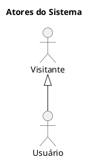
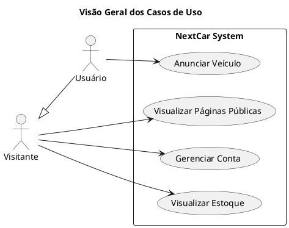
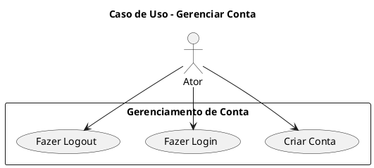
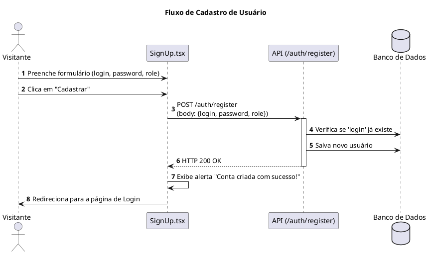
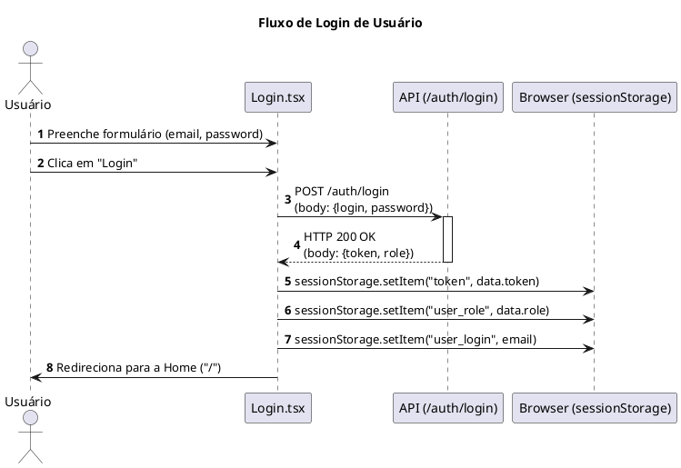
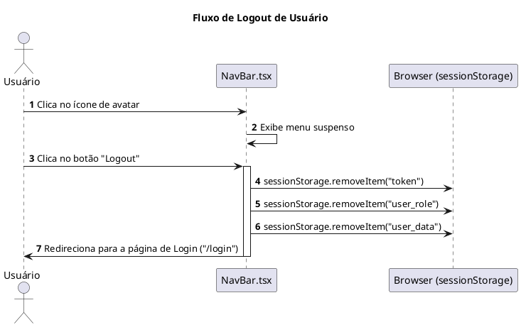
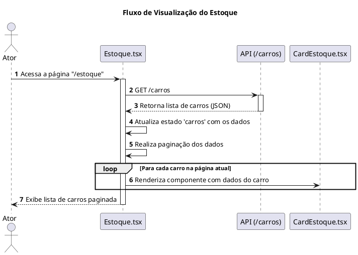
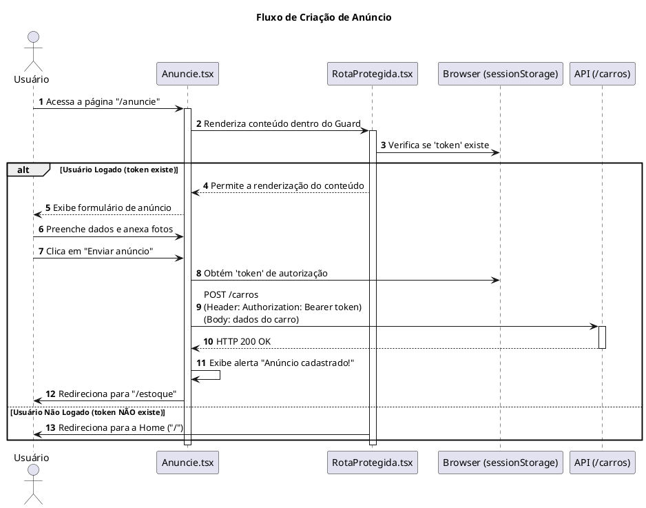

# Documento de Diagramas PlantUML - NextCar

Este documento contém os prompts para gerar os diagramas de Caso de Uso e de Sequência para o projeto NextCar-Front.

---

## 1. Diagramas de Casos de Uso

### 1.1. Atores

Os atores identificados no sistema são:

*   **Visitante**: Qualquer pessoa que acessa o site sem estar autenticada.
*   **Usuário**: Um visitante que se cadastrou e realizou o login no sistema.

### 1.2. Funcionalidades Gerais

Este diagrama mostra a visão geral das principais funcionalidades e quem pode acessá-las.

### 1.3. Detalhamento: Gerenciar Conta

Este diagrama detalha as ações relacionadas à conta de um usuário.

---

## 2. Diagramas de Sequência

### 2.1. Fluxo de Cadastro de Novo Usuário (SignUp)

### 2.2. Fluxo de Autenticação (Login)

### 2.3. Fluxo de Logout

### 2.4. Fluxo de Visualização do Estoque de Carros

### 2.5. Fluxo de Criação de Anúncio (Rota Protegida)

